<div align="center">

# 👋 Hey there, I'm **Keerthan M**

<div>
  
</div>


</div>

---

## 🚀 **About Me**

```python
class Developer:
    def __init__(self):
        self.name = "Keerthan M"
        self.education = "MCA @ RVITM"
        self.interests = [
            "Zero Trust Architecture",
            "Blockchain Technology", 
            "Custom Security Protocols",
            "Full-Stack Development"
        ]
        self.hobbies = ["Photography", "Gaming", "UI/UX Design"]
        
    def current_focus(self):
        return "Building secure, scalable solutions 🛡️"
```

<div align="center">
  
</div>

---

## 💼 **Featured Projects**

<table>
<tr>
<td width="50%">

### 🤖 **AISF** 
*Advanced Intelligent Security Framework*

**Solo Final Year Project**
- AI-powered security with TensorFlow & YOLO
- Real-time OCR processing with Tesseract
- Raspberry Pi deployment with Flask backend

`Python` `Flask` `TensorFlow` `YOLO` `OCR`

</td>
<td width="50%">

### ⛓️ **Grain Supply Blockchain**
*Food Traceability Simulation*

**Research & Development**
- Blockchain-based supply chain tracking
- Smart contract implementation
- Transparent food sourcing system

`Python` `Web3` `Solidity` `Blockchain`

</td>
</tr>
<tr>
<td width="50%">

### 🔐 **Encrypted Chat System**
*Secure Real-time Messaging*

**Network Security Project**
- End-to-end AES encryption
- Socket-based real-time communication
- Secure key exchange protocols

`Python` `Sockets` `AES` `Cryptography`

</td>
<td width="50%">

### 📊 **E-commerce Analytics**
*Flipkart Sales Intelligence*

**Data Science Project**
- Advanced data analytics with pandas
- ML-driven insights with scikit-learn
- Interactive visualizations

`Python` `Pandas` `ML` `Jupyter`

</td>
</tr>
</table>

---

## 🛠️ **Tech Arsenal**

<div align="center">

### **Languages & Frameworks**
<p>
  
</p>

### **Databases & Cloud**
<p>
  
</p>

### **Tools & Platforms**
<p>
  
</p>

</div>

---

## 📈 **GitHub Analytics**

<div align="center">
  
  
</div>

<div align="center">
  
</div>

---

## 🌟 **Current Focus**

```mermaid
graph LR
    A[🔍 Research] --> B[💡 Innovation]
    B --> C[🚀 Implementation]
    C --> D[📊 Analysis]
    D --> A
    
    style A fill:#6C63FF,stroke:#333,stroke-width:2px,color:#fff
    style B fill:#38BCF8,stroke:#333,stroke-width:2px,color:#fff
    style C fill:#FF6B6B,stroke:#333,stroke-width:2px,color:#fff  
    style D fill:#4ECDC4,stroke:#333,stroke-width:2px,color:#fff
```

<div align="center">



</div>

**🎯 Learning Path 2024-25**
- Advanced Zero Trust Security Models
- Blockchain Protocol Development  
- AI/ML Integration in Cybersecurity
- Cloud-Native Application Architecture

---

## 🤝 **Let's Connect**

<div align="center">

[](mailto:keerthanmithal@gmail.com)
[](https://www.linkedin.com/in/keerthan-m-773109230/)
[](https://github.com/keerthan-22)

</div>

---

<div align="center">
  
</div>

<div align="center">
  <b>💡 "Building tomorrow's solutions with today's passion"</b>
  <br><br>
  
</div>
